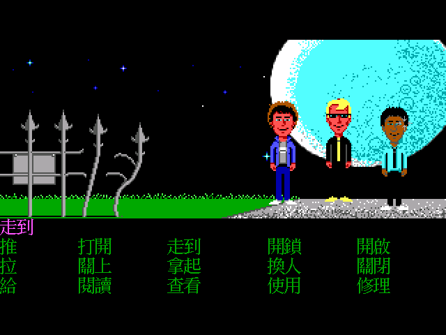
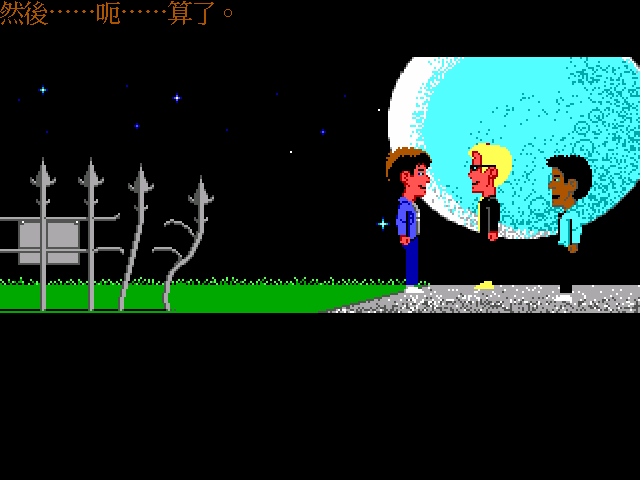
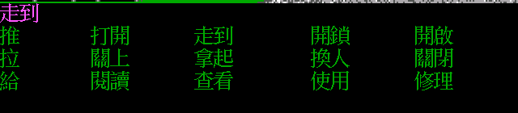
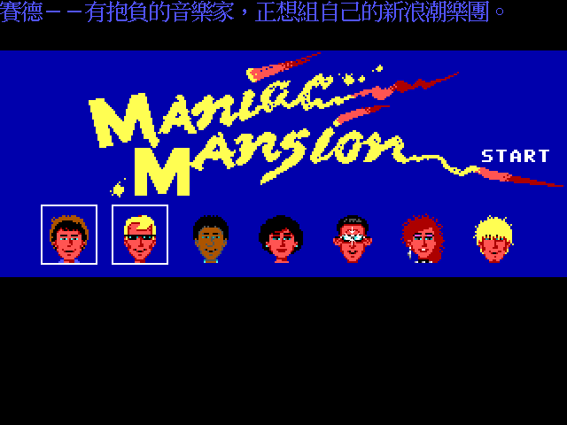
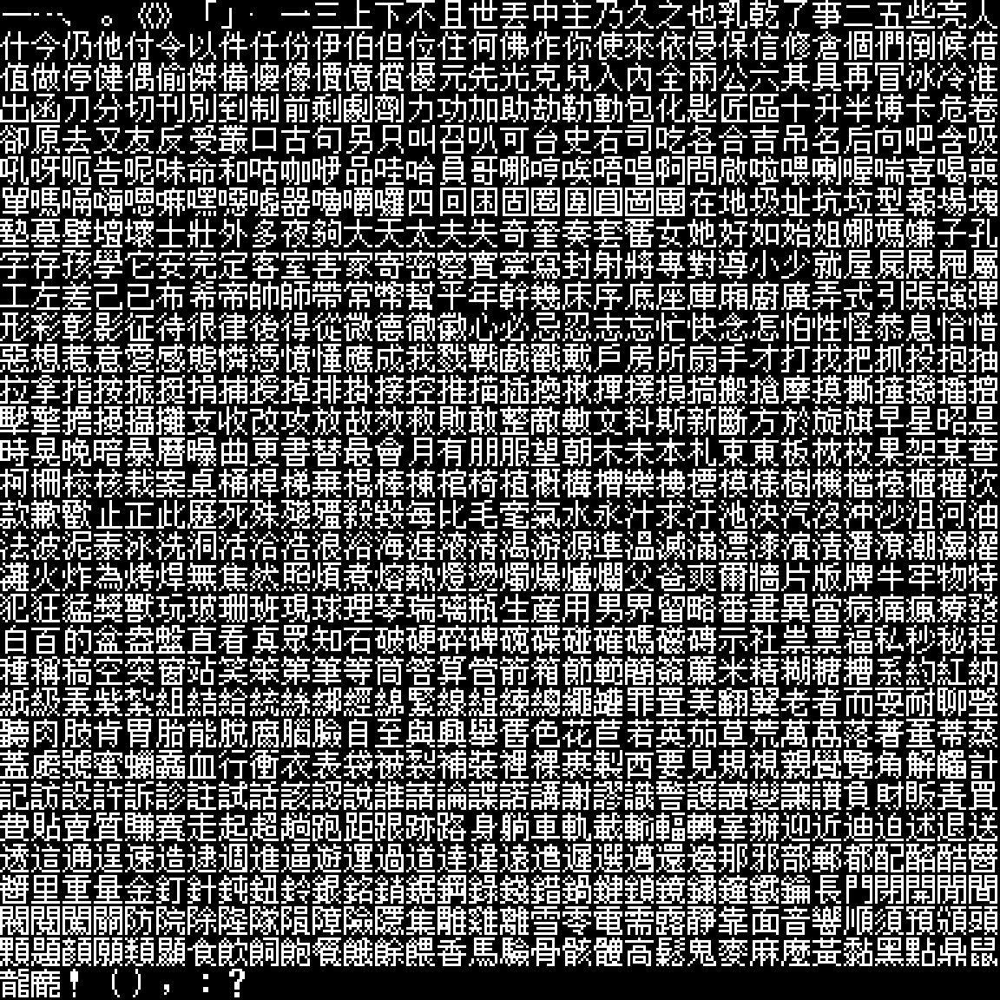
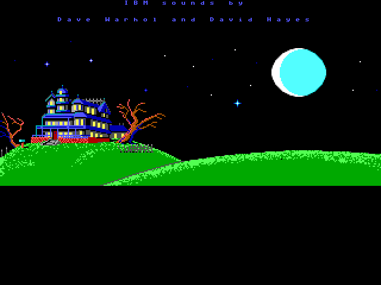
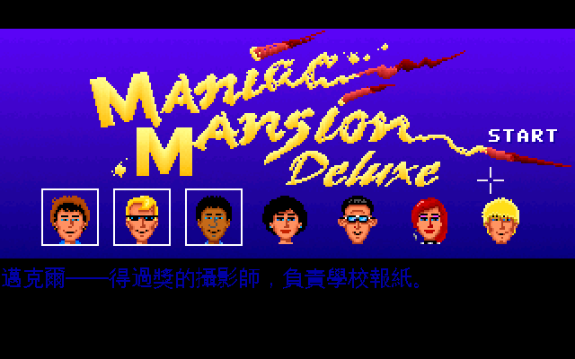
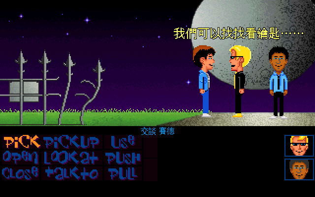

# 瘋狂大樓 繁體中文化（Maniac Mansion，SCUMM v2 + Deluxe 重製版）



二十年前的一個漆黑夜晚，一顆隕石墜落在山丘上的那棟大樓旁。從此那一帶怪事連連。

住在裡面的佛瑞德博士原本是退休醫生，被隕石裡某種神秘力量刺激之後，變成了瘋狂科學家。他的妻子愛德娜護士有些「特殊喜好」，實在令人不敢領教；兒子怪異愛德把鼠輩當成寶貝看待；地下室還養著兩隻觸手怪物，以及某個角落一具表哥泰德的屍體。

現在他綁走了珊蒂。她的男朋友戴夫得從六個朋友裡挑兩個組成三人小組闖進去——**七個可選主角、每人技能與弱點各不相同，你挑誰就決定了故事怎麼走**。1987 年的 LucasArts 用這款遊戲發明了 SCUMM 引擎、也發明了「點按式冒險遊戲」這個類型；此後《猴島小英雄》《印第安納瓊斯》《瘋狂時代》都建在同一套骨架上。



這個 repo 收了**兩套**中文化：1988 年的原版，以及 2004 年的同人重製版 Deluxe。

原版部分把 Enhanced DOS 版（SCUMM v2）完整繁體中文化：**1139 行文字、15 個指令、物件名、選角資料、片頭與結局全部中文**，字型用**倚天中文系統的 24×24 原生點陣字**，畫面拉到 640×480 讓它放得進去，透過 ScummVM 執行。



15 個指令維持原版「5 欄 × 3 列」的排版，只是列距從 8 個邏輯像素放寬到 14——24×24 的倚天字等於 12 個邏輯像素高，照原本的 8 會上下咬在一起。最上面那條洋紅色的是句子列，會把指令與物件名組成一句話（上圖是還沒指到東西時的「走到」）。

## 這是 patch-only 專案

repo 裡**沒有遊戲資料**，只有讓你自己重建中文版所需的東西：

```
patches/            ScummVM 與 ScummTR 的修補（共 254 行新增）
tools/              碼表編解碼、倚天字型烘製、譯文合併
translations/       1139 行繁中譯文（SCUMM v2）
cht_table.json      1000 字的自訂碼表
deluxe/tools/       Deluxe 用：.tra 編解碼、字型精簡、批次檢查
translations/deluxe/ 1219 行繁中譯文（Deluxe）
docs/               技術文件
```

重建步驟見 [`docs/30-pipeline.md`](docs/30-pipeline.md)。你需要自備 Enhanced DOS 版（v2）的 `00.LFL … 53.LFL`；Deluxe 的部分見 [`docs/40-deluxe.md`](docs/40-deluxe.md)。

## 技術上為什麼這款特別麻煩

《瘋狂大樓》是 SCUMM 的**第一款**遊戲。既有的中文化經驗幾乎都來自 v5/v6（《猴島 2》《英雄不再》），少數來自 v3（《札克》）。v2 比它們都低，三道牆是別的版本不會遇到的：

**一、工具直接拒絕動這款遊戲。** ScummTR 從 2022 年起對 Maniac Mansion V2 的所有寫入都 `fatal()`，因為改過之後遊戲會永遠跑 Demo 模式。拆開來看是**兩個互相獨立的根因**：一個是它把「多個物件共用同一份影像」的位移正規化成 0（那是不可逆的破壞，而位移本來就會跟著重定位）；另一個是它抹掉了**原版資料自帶的兩筆死音效索引**。修好之後，「英文原封回填 → 逐檔 byte 比對」達成 **54 個 LFL 全部 byte-perfect**。

**二、v2 的字串把高位元用掉了。** SCUMM v2 的腳本字串有一套空白壓縮：「位元組 | 0x80」代表「這個字元後面接一個空白」，解壓時 `c &= 0x7f` 會把任何中文首碼砍掉。所以碼空間必須避開所有壓縮得出來的值——包括**控制碼**壓縮出來的 `0x81–0x83`，這一點在第一版漏掉了，於是片頭字幕多出一個亂碼字。最終首碼落在 `0x88–0x9F`。

**三、版面根本沒有中文的空間。** v2 的指令畫面總共只有 **56 個邏輯像素**要容納六列文字（句子列 + 指令 3 列 + 物品欄 2 列），一列只有 8px；文字區高度則是腳本傳給 `initScreens(b, h)` 的 `b`，片頭字幕只給 16px = 剛好兩行 8px。任何比 8px 高的中文字都會被裁掉或疊在一起。

解法是**拉畫布，不是縮字**：文字表面放大 2 倍，原始美術照舊 2× nearest 放大不動，中文字則以倚天點陣字直接畫在 2 倍的表面上。ScummVM SCI 引擎的中文化走的是同一條路（`GFX_SCREEN_UPSCALED_640x400`）。

字模用 24×24（等於 12 個邏輯像素），比原版 8×8 的英文大一半，筆劃多的字才擺得下。代價是指令區要重排：那裡要放六列文字（句子列 1、指令 3、物品欄 2），一列 14 就是 84 個邏輯像素，而原本的 144–200 只有 56。差額**不從房間或上方那條字幕帶挖**，而是把畫面總高從 200 加到 240（字幕帶 28 + 房間 128 + 指令區 84）。字幕帶也一起加高：它原本 16 像素剛好兩行 8 像素的字，CJK 行高 14 之後兩行要 28，不加高的話第二行會超出帶子、而清除只清帶子那麼高，片頭製作名單的第二行就會疊上前一則的殘影。指令與物品欄的座標一起換算成 14 格制，那些矩形同時是點擊判定區，所以滑鼠命中會跟著走。

這條路唯一真正缺的一塊在 `drawStripToScreen()`：合成迴圈跑 2× 的目的像素數，卻**線性讀取 1× 的底圖**，所以 m=2 時整片錯位成雪花——這就是「DOS 版 SCUMM 不能拉畫布」這個既有結論的成因。補上「底圖也要 2× nearest 放大」之後就成立了。附帶好處是，第一版為了塞下 12px 中文而動的一堆版面邏輯（句子列清除高度、自動分頁那些）都可以撤掉；現在留下來的版面改動只有指令區的列距與畫布高度兩件事。

完整清單與根因分析：[`docs/00-engine-verification.md`](docs/00-engine-verification.md)、[`docs/20-patches.md`](docs/20-patches.md)。

## 譯名沿用軟體世界的中文說明書



當年在台灣代理這款遊戲的是**軟體世界（Soft-World）**，貴族版第 068 號附有完整的中文說明書。這份說明書早就給了官方中譯，包括七位主角、Edison 一家、以及 15 個指令的語意說明，所以譯名不需要重新發明。掃描件由「骨灰集散地」說明書補完計劃於 2018 年完成。

| 原文 | 中譯 | 說明書設定 |
|---|---|---|
| Dave Miller | 戴夫 | 珊蒂的男朋友，救難小組必選的第一人 |
| Syd | 賽德 | 有抱負的音樂家，想組自己的新浪潮樂團 |
| Michael | 邁克爾 | 得過獎的攝影師，負責學校報紙 |
| Wendy | 溫蒂 | 想成為著名小說家，一直等著發一筆大財 |
| Bernard | 伯納 | 物理學社社長，學院 Geek 獎得主 |
| Razor | 瑞爾 | "Razor and the Scummettes" 搖滾樂團主唱 |
| Jeff | 傑夫 | 常在海灘游蕩，配得上衝浪帥哥之名 |
| Dr. Fred | 佛瑞德博士 | 退休醫生，受隕石神秘影響變成瘋狂科學家 |
| Nurse Edna | 愛德娜護士 | 博士的妻子，「特殊喜好」令人不敢領教 |
| Weird Ed | 怪異愛德 | 承襲家族怪異特性，把鼠輩當成寶貝看待 |
| Green Tentacle | 大食怪 | 擋路的怪物，餵不飽 |
| Purple Tentacle | 紫色怪物 | 與大食怪長相相似，博士的助手 |

完整譯名表與 15 個指令的對照：[`docs/10-glossary.md`](docs/10-glossary.md)。

## 字型



**倚天中文系統（ETEN 3.53）的 24×24 原生點陣字**（`STD.24M` 明體，ETUNPACK 壓縮，解開後 13094 字）——1990 年代 DOS 中文長什麼樣，倚天就長什麼樣。這是為 24 點手工調過的點陣字，不是把 TTF 輪廓縮到這個尺寸。字模尺寸由字型檔的大小決定（2232 字 × 30 bytes = 16×15、× 72 = 24×24），所以換字型檔就等於換尺寸。

`tools/build_eten_font.py` 依碼表把倚天字形重排成引擎要的順序。ScummVM 對 `_2byteWidth = 24, _2byteHeight = 24` 算出的 stride 是 `3 × 24 = 72` bytes，**與倚天 24 點字型解開後的原生格式完全相同**，所以漢字與標點都是直接搬 72 bytes，不做任何縮放或重新取樣（16×15 那條路同理，stride 30）。

兩個要注意的點：

* **`STDFONT` 只有漢字**，從 `A440`（「一」）起算，不含全形標點（`A140–A3BF`）。只帶它去烘，「，。！？「」（）」全都會缺字，所以一定要一起帶 `SPCFONT`（與補充區 `SPCFSUPP`）。24 點那組還多一道手續：`STD.24M` 是 `ETUNPACK V1.00` 壓縮檔（三棵靜態 Huffman 樹 + 列間 XOR 差分），要先解成 942 768 bytes 才能用。
* **Big5 索引不是線性的**，要走分區公式（符號區／常用字／次常用字三段）。驗證用的 oracle 是「`STDFONT` 的 `idx=0` 必須是『一』，也就是一條橫線」，先過這關再往下做，否則整批字會整體偏移，看起來像「有字但都不對」。

本作 1000 字裡 Big5 缺字只有 1 個（`・` U+30FB，0.10%），改用 WenQuanYi 描同尺寸補上。**fallback 數量是品質指標**：若一大批字掉進 fallback，先懷疑索引公式或漏帶 `SPCFONT`，不要無腦補字型。

24 點有明／楷／隸／圓／黑／宋六種字體可選，這裡用明體（`STD.24M`）。（先前用的 15 點只有偏細的明體一種，得靠 `--embolden` 補厚。）

也試過另一條路並放棄：把倚天字縮到 12×12（各種閾值、加粗都試過），筆畫多的字如「讀」「觸」會糊成一團。這印證了點陣字的通則——**為該尺寸手工設計的字，勝過從大尺寸機器縮小**；所以正解是拉畫布讓原生尺寸放得進去，而不是把它縮小。

## 保留原文的部分



有 118 行刻意沒有翻譯：

* **開發者名單** —— 人名照原樣。
* **媒體評語**（`Game of the Year` 那一段獎項捲動）—— 引用的是英文媒體原文；而且這些是用 verbOps 畫的多列裝飾文字，8px 列距放不進中文。
* **存檔欄位** `Game A`–`Game J`、電話號碼、車牌 `ED SEL`。
* **雕像銘牌上的法文** `Si trouve, envoyez-le au Louvre, poste paye.` —— 這句在英文原版裡本來就是法文，笑點就在「它是法文」。
* **片頭導覽模式裡那張假的指令列圖** —— 那是畫在背景裡的裝飾圖，真正的指令列已經中文化。

另外有**一句台詞抽不出來**：07.LFL 的 script #59 在 `stopScript(0)` 之後接了一段不可及的字串常數 `"It's already full."`。ScummTR 與 descumm 在完全相同的位置失步，所以那是原版資料的遺留物、不是工具的問題。詳見 [`docs/00-engine-verification.md`](docs/00-engine-verification.md)。

## Deluxe 重製版也一起中文化了



2004 年 Lucasfan Games 用 **AGS**（Adventure Game Studio）重製的 *Maniac Mansion Deluxe*，畫面重畫成 VGA、加了新房間與新台詞。它不是 SCUMM，但 ScummVM 2.6 起內建 AGS 引擎，所以一樣掛在 ScummVM 下跑。

**1219 行全部翻完**，而且幾乎不必動引擎——原因是 AGS 自己就有翻譯機制，而且這款遊戲隨片附了德／法／西等 14 份 `.tra`：

* `.tra` 的鍵就是英文原文，所以**不需要 AGS Editor 也拿得到完整字串集**。
* 翻譯檔可以自己宣告 `encoding=utf-8`，ScummVM 讀到就切 UTF-8 文字模式，**與遊戲版本無關**——2004 年的 AGS 2.x 老遊戲也吃這套。
* 字型載入時先試 `agsfnt%d.ttf` 再退回內建點陣字，所以把中文 TTF 放進遊戲目錄就能覆蓋。

唯一擋住的是尺寸：AGS 3.0 以前的遊戲資料沒有字型大小欄位，替換進去的 TTF 一律以 8px 載入，中文糊成一團。試過用 fontTools 改 `unitsPerEm` 讓字形放大——字形與推進寬確實一起放大了（用 FreeType 量過），但**行距取的是「名目高度」而不是實際字形高度**，於是上下兩行相疊。名目尺寸這個數字只有引擎給得出來，所以補了 13 行讓 config 可以覆寫它。

字級調得再準，320×200 的畫面上中文還是糊——16px 的字要再被顯示層放大一次，筆畫粗細就不均了。解法不是繼續調字型，而是**讓遊戲跑在 640×400**：AGS 對 3.1 以前的遊戲留了一條 upscale 路徑，在遊戲夾的 `acsetup.cfg` 加

```ini
[override]
upscale=1
```

啟動訊息就從 `Game native resolution: 320 x 200` 變成 `640 x 400`，美術與版面完全不動，只有文字可用的像素多了一倍。字級開到 24（等於原本畫面的 12px），筆畫細節放得下，選單按鈕也還在框裡。**這一段是純資料設定，不必再動引擎。**

改成 640 之後才發現譯文裡那組 `font_320` / `font_640` 數字是**字型槽編號表**（21 種文字情境各用哪一號槽），不是位移量：320 模式用 {1, 0, 3} 號槽，640 模式改用 {13, 14}。所以中文字型得鋪滿 0–14 號槽，漏了就掉回內建點陣字。

驗證過程也抓到一個純中文才會遇到的坑：譯文裡用的省略號「⋯」（U+22EF）在 WQY Zen Hei 裡根本沒有字形，FreeType 照畫不誤——畫成空心方框，而且不報錯。288 處對白開頭全中招。換成中文標準的「……」（U+2026）就好了，並把「字型缺字」加進建置檢查（後來人名間隔號也被同一個檢查擋下：U+2027 在 WQY 裡同樣沒有字形，改用 U+00B7）。



句子列（畫面下方那條「你要做什麼」）與九個指令按鈕在同一個 GUI 上，中間只有約 18px 的空檔，24px 的中文下緣會被按鈕的圖蓋掉。縮字形沒有用——`unitsPerEm` 只縮字形，基線位置仍由名目尺寸決定，字反而更貼下緣。解法是讓句子列**單獨換一個字型槽**：`font_640` 的第 1 個位置就是句子列（用「每個位置改指專屬槽 + 每槽不同字級」跑一次量出來的），把它從 14 號槽改指沒人用的 12 號槽，再用引擎修補新增的 `ags_ttf_font_size_12=16` 單獨調小，對白仍是 24px。

一個誠實的限制：Deluxe 指令列那九個按鈕（Give / PICKUP / USE …）是**手繪 sprite**，存在 AGS 的資料檔裡，翻譯機制碰不到，所以維持英文。真正描述「你要做什麼」的那條句子列已經是中文（上圖的「交談 賽德」）。要換掉按鈕得解 CLIB 改 sprite，是另一個規模的子專案。

細節見 [`docs/40-deluxe.md`](docs/40-deluxe.md)，現況與已知限制見 [`docs/50-status.md`](docs/50-status.md)。

## 怎麼跑起來

三個平台各出一支自編的 ScummVM，**同一支 binary 同時含 SCUMM 與 AGS 兩個引擎**，所以 1988 年的原版與 2004 年的 Deluxe 都用它跑。

| 平台 | 產物 | 怎麼做出來的 |
|---|---|---|
| Linux | `.AppImage` | 本機 docker 建置，`appimagetool --appimage-extract-and-run` |
| Windows | `.zip`（`scummvm.exe` + DLL） | mingw-w64 交叉編，用 wine 實跑驗過 |
| macOS | `.app`（universal，arm64 + x86_64） | GitHub Actions `macos-14`，每弧各編再 `lipo` 合併 |

每個平台各兩種包：**full** 內嵌中文化好的遊戲、開了就能玩，只留本機；**patch** 只有引擎與中文資料，玩家自備遊戲。

建置與打包的完整說明、以及這一路踩到的雷（AGS 的 libmad 相依會被 configure 靜靜關掉、AGS 的 TTF 要的是 ScummVM 的 FreeType 而不是它自帶那份、mingw 的 `config.h` exclude 要錨定路徑⋯⋯）見 [`docs/60-packaging.md`](docs/60-packaging.md)。

## 授權與版權

* 本專案自己的產出（patch、工具、譯文、文件）採 MIT。
* ScummVM 為 GPLv3+，ScummTR 為 MIT；散布修改過的二進位檔時必須一併附上對應原始碼。
* 《Maniac Mansion》的所有權利屬於原權利人。本 repo **不含**任何遊戲資料、美術或音樂；截圖僅用於說明中文化成果。
* *Maniac Mansion Deluxe* 是 Lucasfan Games 的同人重製版，版權屬其作者。本 repo 同樣不含其遊戲資料。
* 說明書掃描件由「骨灰集散地」說明書補完計劃提供，依其要求：請勿加上其他符號或用於牟利。

## 參考

* [`indiana-jones-and-last-crusade-cht`](https://github.com/wicanr2/indiana-jones-and-last-crusade-cht) —— 同作者的《聖戰奇兵》中文化
* [dwatteau/scummtr](https://github.com/dwatteau/scummtr) —— SCUMM 抽字／回填工具
* [ScummVM](https://www.scummvm.org/)
