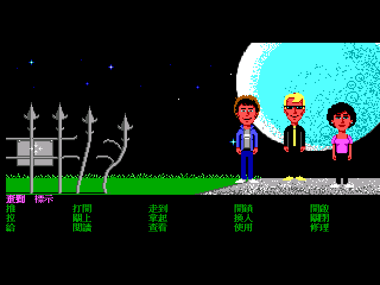

# 瘋狂大樓 繁體中文化（Maniac Mansion / SCUMM v2）


二十年前的一個漆黑夜晚，一顆隕石墜落在山丘上的那棟大樓旁。從此那一帶怪事連連。

住在裡面的佛瑞德博士原本是退休醫生，被隕石裡某種神秘力量刺激之後，變成了瘋狂科學家。他的妻子愛德娜護士有些「特殊喜好」，實在令人不敢領教；兒子怪異愛德把鼠輩當成寶貝看待；地下室還養著兩隻觸手怪物，以及某個角落一具表哥泰德的屍體。

現在他綁走了珊蒂。她的男朋友戴夫得從六個朋友裡挑兩個組成三人小組闖進去——**七個可選主角、每人技能與弱點各不相同，你挑誰就決定了故事怎麼走**。1987 年的 LucasArts 用這款遊戲發明了 SCUMM 引擎、也發明了「點按式冒險遊戲」這個類型；此後《猴島小英雄》《印第安納瓊斯》《瘋狂時代》都建在同一套骨架上。


這個專案把 1988 年的 Enhanced DOS 版（SCUMM v2）完整繁體中文化：**1139 行文字、15 個指令、物件名、選角資料、片頭與結局全部中文**，字型用**倚天中文系統的 16×15 原生點陣字**，畫面拉到 640×400 讓它放得進去，透過 ScummVM 執行。


15 個指令維持原版「5 欄 × 3 列」的排版沒有動——16×15 的倚天字畫在 2 倍的文字表面上，只佔 8×7.5 個邏輯像素，跟原版 8×8 的英文幾乎同尺寸。上面那條洋紅色的句子列會把指令與物件名組成一句話：



## 這是 patch-only 專案

repo 裡**沒有遊戲資料**，只有讓你自己重建中文版所需的東西：

```
patches/       ScummVM 與 ScummTR 的修補（共 178 行新增）
tools/         碼表編解碼、倚天字型烘製、譯文合併
translations/  1139 行繁中譯文
cht_table.json 1000 字的自訂碼表
docs/          技術文件
```

重建步驟見 [`docs/30-pipeline.md`](docs/30-pipeline.md)。你需要自備 Enhanced DOS 版（v2）的 `00.LFL … 53.LFL`。

## 技術上為什麼這款特別麻煩

《瘋狂大樓》是 SCUMM 的**第一款**遊戲。既有的中文化經驗幾乎都來自 v5/v6（《猴島 2》《英雄不再》），少數來自 v3（《札克》）。v2 比它們都低，三道牆是別的版本不會遇到的：

**一、工具直接拒絕動這款遊戲。** ScummTR 從 2022 年起對 Maniac Mansion V2 的所有寫入都 `fatal()`，因為改過之後遊戲會永遠跑 Demo 模式。拆開來看是**兩個互相獨立的根因**：一個是它把「多個物件共用同一份影像」的位移正規化成 0（那是不可逆的破壞，而位移本來就會跟著重定位）；另一個是它抹掉了**原版資料自帶的兩筆死音效索引**。修好之後，「英文原封回填 → 逐檔 byte 比對」達成 **54 個 LFL 全部 byte-perfect**。

**二、v2 的字串把高位元用掉了。** SCUMM v2 的腳本字串有一套空白壓縮：「位元組 | 0x80」代表「這個字元後面接一個空白」，解壓時 `c &= 0x7f` 會把任何中文首碼砍掉。所以碼空間必須避開所有壓縮得出來的值——包括**控制碼**壓縮出來的 `0x81–0x83`，這一點在第一版漏掉了，於是片頭字幕多出一個亂碼字。最終首碼落在 `0x88–0x9F`。

**三、版面根本沒有中文的空間。** v2 的指令畫面總共只有 **56 個邏輯像素**要容納五列文字（句子列 + 指令 3 列 + 物品欄 2 列），列距上限 11px；文字區高度則是腳本傳給 `initScreens(b, h)` 的 `b`，片頭字幕只給 16px = 剛好兩行 8px。任何比 8px 高的中文字都會被裁掉或疊在一起。

解法是**拉畫布，不是縮字**：文字表面放大 2 倍（640×400），原始美術照舊 2× nearest 放大不動，中文字則以 16×15 的倚天點陣字直接畫在 2 倍的表面上。於是 **16×15 的字模只佔 8×7.5 個邏輯像素**，與原版 8×8 的 ASCII 幾乎同尺寸——指令列 3 列、16px 文字區兩行、行距全都不必改。ScummVM SCI 引擎的中文化走的是同一條路（`GFX_SCREEN_UPSCALED_640x400`）。

這條路唯一真正缺的一塊在 `drawStripToScreen()`：合成迴圈跑 2× 的目的像素數，卻**線性讀取 1× 的底圖**，所以 m=2 時整片錯位成雪花——這就是「DOS 版 SCUMM 不能拉畫布」這個既有結論的成因。補上「底圖也要 2× nearest 放大」之後就成立了。附帶好處是，第一版為了塞下 12px 中文而動的五處版面邏輯（指令列重排、物品欄列距、句子列清除高度、行距、自動分頁）全部可以撤掉，patch 從 6 檔 173 行縮到 4 檔 134 行。

完整清單與根因分析：[`docs/00-engine-verification.md`](docs/00-engine-verification.md)、[`docs/20-patches.md`](docs/20-patches.md)。

## 譯名沿用軟體世界的中文說明書


當年在台灣代理這款遊戲的是**軟體世界（Soft-World）**，貴族版第 068 號附有完整的中文說明書。這份說明書早就給了官方中譯，包括七位主角、Edison 一家、以及 15 個指令的語意說明，所以譯名不需要重新發明。掃描件由「骨灰集散地」說明書補完計劃於 2018 年完成。

| 原文 | 中譯 | 說明書設定 |
|---|---|---|
| Dave Miller | 戴夫 | 珊蒂的男朋友，救難小組必選的第一人 |
| Syd | 賽德 | 有抱負的音樂家，想組自己的新浪潮樂團 |
| Michael | 邁克爾 | 得過獎的攝影師，負責學校報紙 |
| Wendy | 溫蒂 | 想成為著名小說家，一直等著發一筆大財 |
| Bernard | 伯納 | 物理學社社長，學院 Geek 獎得主 |
| Razor | 瑞爾 | "Razor and the Scummettes" 搖滾樂團主唱 |
| Jeff | 傑夫 | 常在海灘游蕩，配得上衝浪帥哥之名 |
| Dr. Fred | 佛瑞德博士 | 退休醫生，受隕石神秘影響變成瘋狂科學家 |
| Nurse Edna | 愛德娜護士 | 博士的妻子，「特殊喜好」令人不敢領教 |
| Weird Ed | 怪異愛德 | 承襲家族怪異特性，把鼠輩當成寶貝看待 |
| Green Tentacle | 大食怪 | 擋路的怪物，餵不飽 |
| Purple Tentacle | 紫色怪物 | 與大食怪長相相似，博士的助手 |

完整譯名表與 15 個指令的對照：[`docs/10-glossary.md`](docs/10-glossary.md)。

## 字型


**倚天中文系統（ETEN 3.53）的 16×15 原生點陣字**——1990 年代 DOS 中文長什麼樣，倚天就長什麼樣。這是為 15 點手工調過的點陣字，不是把 TTF 輪廓縮到這個尺寸。

`tools/build_eten_font.py` 依碼表把倚天字形重排成引擎要的順序。ScummVM 對 `_2byteWidth = 16, _2byteHeight = 15` 算出的 stride 是 `2 × 15 = 30` bytes，**與倚天 `STDFONT.15` 的原生格式完全相同**，所以漢字與標點都是直接搬 30 bytes，不做任何縮放或重新取樣。

兩個要注意的點：

* **`STDFONT.15` 只有漢字**，從 `A440`（「一」）起算，不含全形標點（`A140–A3BF`）。只帶它去烘，「，。！？「」（）」全都會缺字，所以一定要一起帶 `SPCFONT.15`（與補充區 `SPCFSUPP.15`）。
* **Big5 索引不是線性的**，要走分區公式（符號區／常用字／次常用字三段）。驗證用的 oracle 是「`STDFONT.15` 的 `idx=0` 必須是『一』，也就是一條橫線」，先過這關再往下做，否則整批字會整體偏移，看起來像「有字但都不對」。

本作 1000 字裡 Big5 缺字只有 1 個（`・` U+30FB，0.10%），改用 WenQuanYi 描同尺寸補上。**fallback 數量是品質指標**：若一大批字掉進 fallback，先懷疑索引公式或漏帶 `SPCFONT`，不要無腦補字型。

15 點只有偏細的明體一種，所以預設開 `--embolden`（每列與左移一格 OR，筆畫水平膨脹 1px）讓它厚實一點；複雜字仍保持原生 15 點的手工結構。

也試過另一條路並放棄：把倚天 15 點縮到 12×12（各種閾值、加粗都試過），筆畫多的字如「讀」「觸」會糊成一團。這印證了點陣字的通則——**為該尺寸手工設計的字，勝過從大尺寸機器縮小**；倚天沒有 12 點字，所以正解是拉畫布讓 15 點放得進去，而不是把它縮小。

## 保留原文的部分


有 118 行刻意沒有翻譯：

* **開發者名單** —— 人名照原樣。
* **媒體評語**（`Game of the Year` 那一段獎項捲動）—— 引用的是英文媒體原文；而且這些是用 verbOps 畫的多列裝飾文字，8px 列距放不進中文。
* **存檔欄位** `Game A`–`Game J`、電話號碼、車牌 `ED SEL`。
* **雕像銘牌上的法文** `Si trouve, envoyez-le au Louvre, poste paye.` —— 這句在英文原版裡本來就是法文，笑點就在「它是法文」。
* **片頭導覽模式裡那張假的指令列圖** —— 那是 3 列 8px 的裝飾圖，真正的指令列已經中文化。

另外有**一句台詞抽不出來**：07.LFL 的 script #59 在 `stopScript(0)` 之後接了一段不可及的字串常數 `"It's already full."`。ScummTR 與 descumm 在完全相同的位置失步，所以那是原版資料的遺留物、不是工具的問題。詳見 [`docs/00-engine-verification.md`](docs/00-engine-verification.md)。

## 授權與版權

* 本專案自己的產出（patch、工具、譯文、文件）採 MIT。
* ScummVM 為 GPLv3+，ScummTR 為 MIT；散布修改過的二進位檔時必須一併附上對應原始碼。
* 《Maniac Mansion》的所有權利屬於原權利人。本 repo **不含**任何遊戲資料、美術或音樂；截圖僅用於說明中文化成果。
* 說明書掃描件由「骨灰集散地」說明書補完計劃提供，依其要求：請勿加上其他符號或用於牟利。

## 參考

* [`indiana-jones-and-last-crusade-cht`](https://github.com/wicanr2/indiana-jones-and-last-crusade-cht) —— 同作者的《聖戰奇兵》中文化
* [dwatteau/scummtr](https://github.com/dwatteau/scummtr) —— SCUMM 抽字／回填工具
* [ScummVM](https://www.scummvm.org/)
